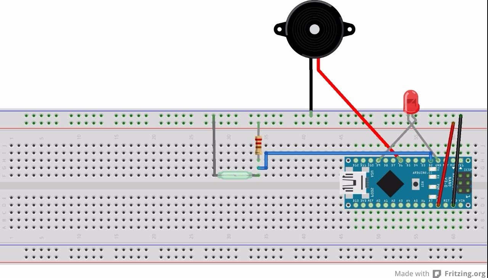
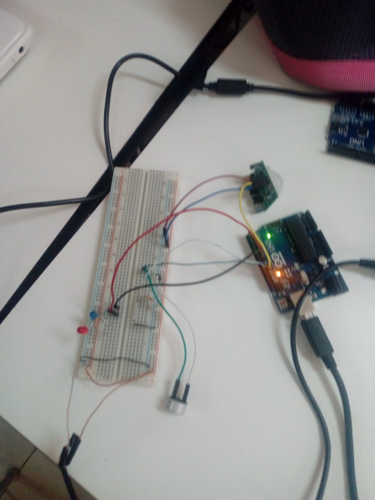
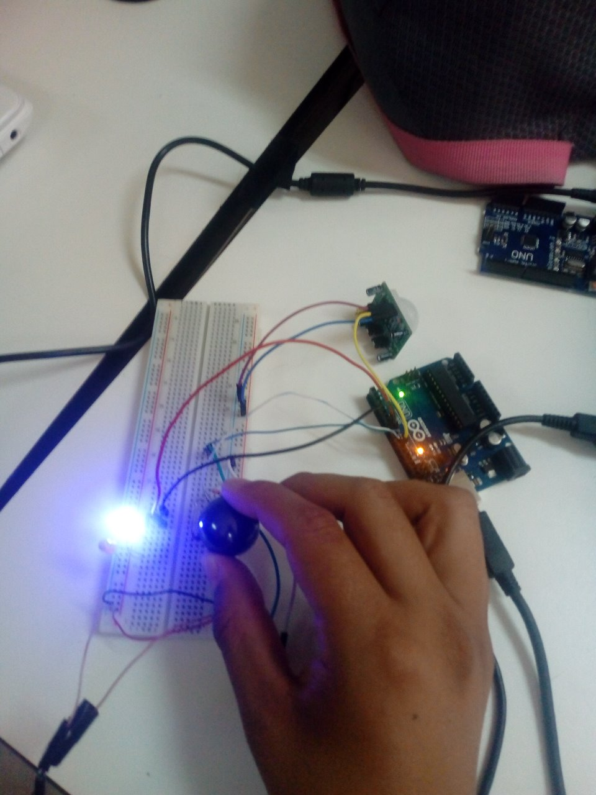
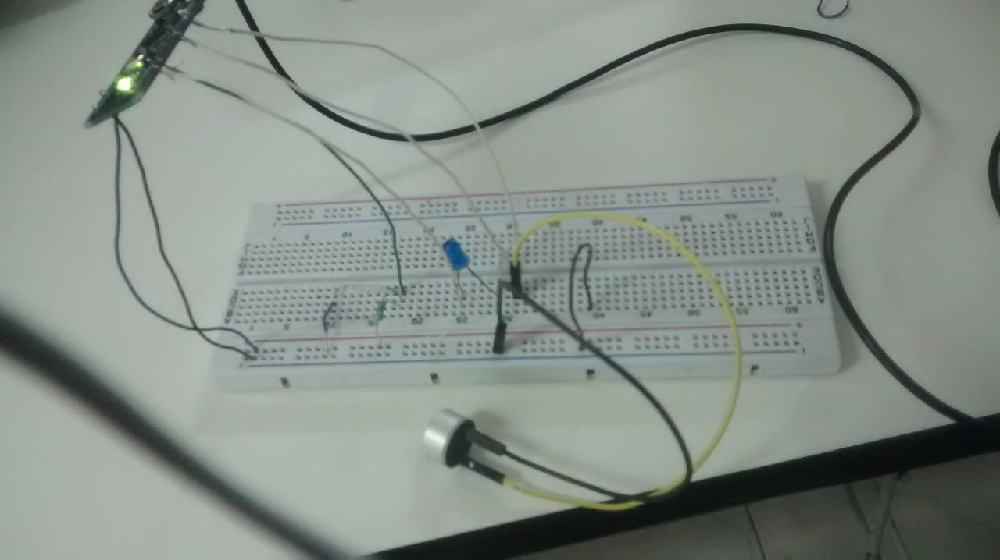
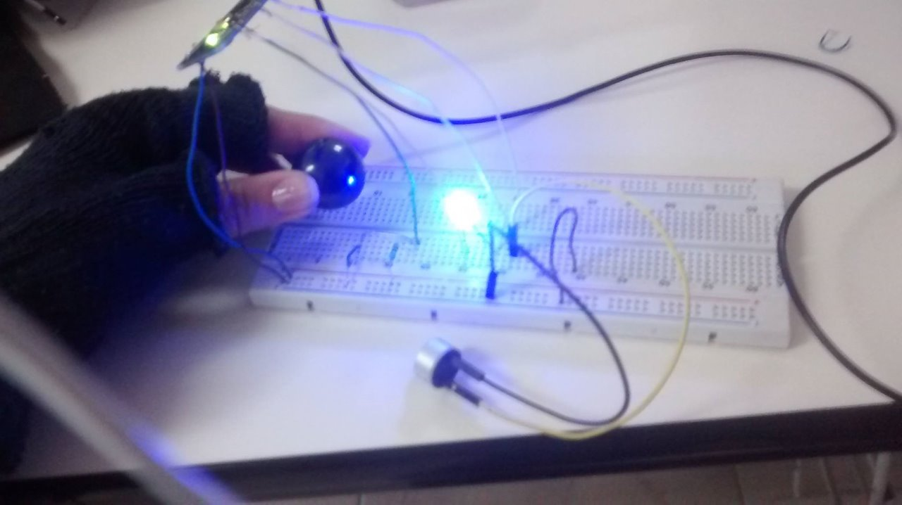
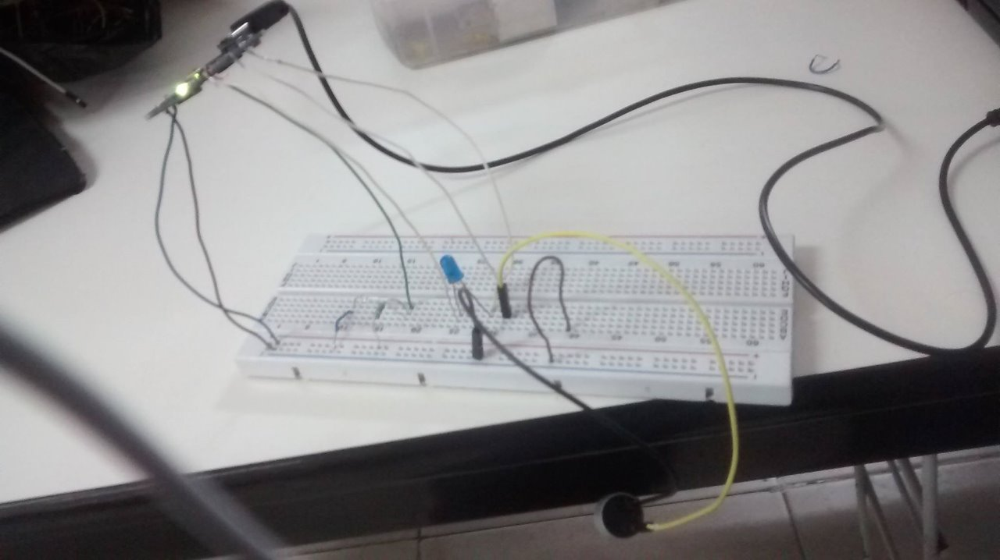

# Alarma-para-Puerta
El término alarma puede hacer referencia a:

  -Una alarma es el sonido o música que emite un reloj despertador o una agenda electrónica a una hora determinada.

  -Una alarma autollamadora, en el que los transmisores portátiles envían una señal a la unidad de alarma.

  -Una alarma de incendio, un dispositivo que advierte a la gente de un edificio de un posible fuego, para realizar su evacuación.

  -Un aviso de alarma, una señal por medio de la cual se informa sobre la presencia real o inminente de una amenaza.

  -Un sistema de alarma, un elemento de seguridad pasiva, capaz de advertir la intrusión o allanamiento de una propiedad o inmueble.
  
Un sistema de alarma es un elemento de seguridad pasiva. Esto significa que no evitan una situación anormal, pero sí son capaces de advertir de ella, cumpliendo así, una función disuasoria frente a posibles problemas.

El objetivo del programa es simular una alarma usando un REED SWITCH y un BUZZER. Si el campo magnético del REED SWITCH es interferido por alguna señal (en este caso el iman), envía una señal al BUZZER y al LED para que enciende simulando la alarma con sonido y luz.

